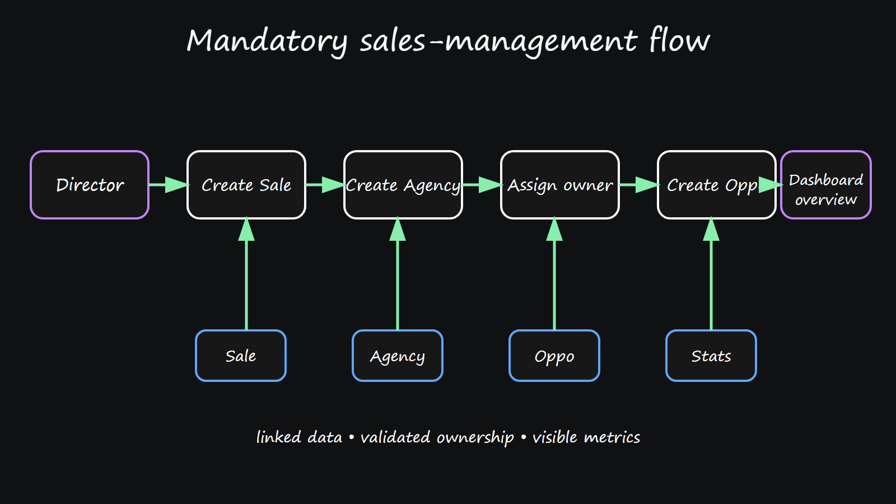
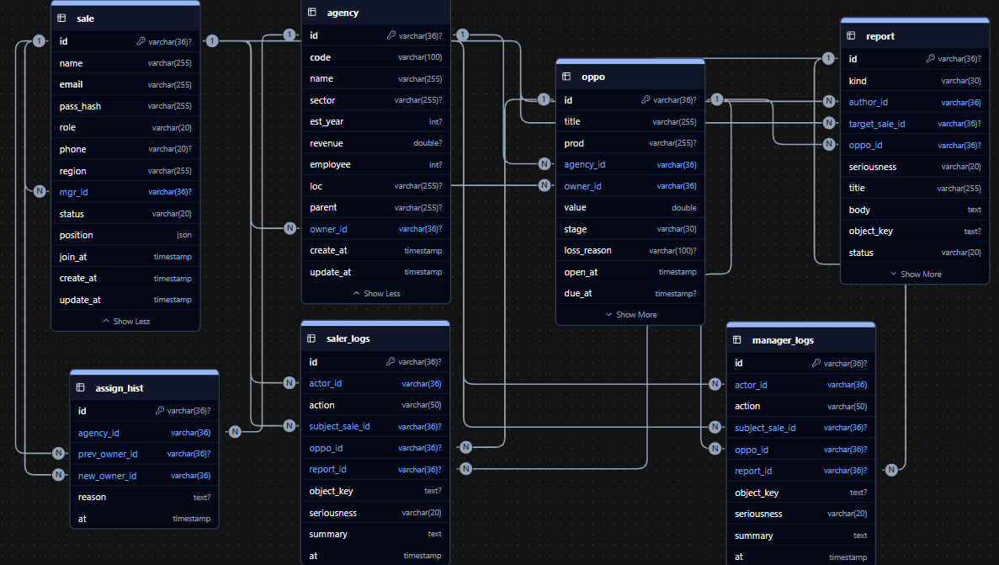
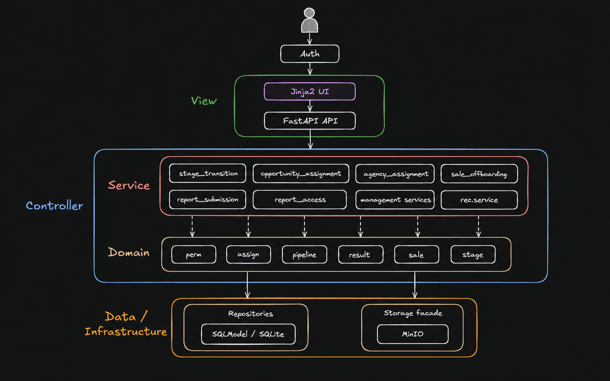

# Sales App
An app managing sale teams workflows, documents and staffs following procedure:


Frontend: Jjinra with Js scripts

Backend: FastAPI + SQLModel + SQLite, managed with `uv`.

**Current state:** the server-rendered application, scoped repositories, seed/ETL, dashboards,
MinIO report workflows, tests, and benchmark-selected recommendation engine are implemented.

## Dataset

The dataset im using is: https://mavenanalytics.io/data-playground/crm-sales-opportunities
A popular dataset for real sales data, already organized into 4 different schemas with only minor adjustment:
- Table accounts: represent account of customers
- Table products: Products that companies sold
- Table sales_pipeline: shows exactly the spirit of the objectives: a standard sale tracking table tracking employee, customers, stage and revenue
- Table sales_teans: team with members and their managers

## Functional requirements
- Login as Salers, Managers, Director 

### Director
From now on remove Gemini narrative the data is direct enough. Instead

#### Management tab: 
- View the overall revenue chart in months at the beginning
- View logs of managers, with lookup (another table manager_logs). Logged actions includes team revenue changes, reports of managers. Click to show full report in shared MiniO space (for demo)
- View the best/worst team (list with ordering feature) in the months and how they perform comparing to standard EMA
- Click teams to open their own overall revenue chart as well as salers contribution on the left of the chart, and progress below
- Kick salers directly (that open a documents writing reasons), when the mouse hover into kick it takes 3 second to fully load red only that can it be kicked (delayed confirm)
#### Business tab
- CRUD with Oppoturnity, along with assign buttons where you can tick all oppoturnity then click assign to a specific team
- Recommendation engines using linear regressions (or alternative, we dig in that later) that recommend oppo to salers based on: victory rate in general - victory rate in that fields, victory rate of the team in that field, revenue in that field, average time per victory (all normalized dynamically, algorithm need discussion). Finally rerank via Position (first-order criteria any position that doesnt match get pushed below the match one). UI need clever adjustment too

### Manager
#### Management tab: 
- View the team overall revenue chart in months at the beginning
- View the best/worst team (list with ordering feature) in the months and how they perform comparing to standard EMA
- View logs of salers, with lookup (another table salers_logs). Logged actions includes team revenue changes, reports of salers, request of salers. Click to show full report in shared MiniO space (for demo)
- Propose kicking salers (that open a documents writing reasons), when the mouse hover into kick it takes 3 second to fully load red only that can it be pressed (delayed confirm). Same as director but does not kick instead sent 
- Open Frequent Report - basically a forum with things you need to fill in bout staffs, sale details or issues with business or management
### Salers
- Update sale details that requiring a Sale_Report that got all required fields filled
- See unhandled oppoturnity and press request take charge forum or some shii that got sended to Managers
- Open Frequent Report - basically a forum with things you need to fill in bout sale details or issues with business, or workplace. Of course click send.
- All Frequent Report are allowed with option of seriousness that shows colours and letter size in the log table of upper manager

## Database
### MiniO
For demo only safety reasons and others are temporarily ignored:
```
team_{Managers_name}/
   |------- manager_rep
   |------- saler_{name}
   ```
### SQL
4 original schema with 3 logging table for action logs and for reports tracking, job status


Read [report](./report/main.pdf) page 7 for further details

## System arch
Layered architecture with UI ---> API (Protocol with backend) -----> service (completed request via orchestration of logical submodules) ----> domain (sale domain logical submodules) -----> Data Modelling -----> DB Infra (SQL, MiniO)

Read [report](./report/main.pdf) page 4 for further details

## Test case
42 test cases all passes with warning of a deprecated function in the pytest library
Read [testcase.md](./src/tests/TEST_CASES.md) for further details
## Setup and implementation
### Installation

Requires Python >=3.11 and [`uv`](https://docs.astral.sh/uv/). Docker is optional but recommended for the MinIO-backed report flow.

```bash
uv sync
```

This installs project dependencies and the local package in editable mode. Runtime code resolves from `src/app/`; shared configuration lives in `app.core`, and SQLModel schema objects live in `app.core.schema`.

### Database setup

```bash
uv run alembic upgrade head       # create sales.db and apply the schema
uv run python -m app.seed         # import the CRM CSVs from src/data/
```

The seed step is idempotent and validates existing databases. Expected first-run output:

```
Seeded 42 Sale, 85 Agency, 7375 Oppo, 85 AssignHist; WON=4238, LOST=2473; skipped=1425.
```

The 1,425 skipped rows are opportunities with no company name in the source data; all are
open-stage deals, so the closed-deal counts (4,238 Won / 2,473 Lost) are unaffected. See
`AI_USAGE.md` for how this was verified against the raw CSV before writing the ETL rule.

To rebuild application rows safely and verify the result:

```bash
uv run python -m app.seed --reseed
```

### Run

Start MinIO for Markdown reports, then start the web application:

```bash
docker compose -f src/docker-compose.yml up -d
uv run uvicorn app.main:app --reload
```

Open `http://127.0.0.1:8000`. All seeded users share `demo123` unless `DEMO_PASSWORD` is set:

- Director: `director@demo.local`
- Manager example: `dustin-brinkmann@demo.local`
- Saler example: `anna-snelling@demo.local`

## Verify and benchmark

```bash
uv run pytest src/tests
uv run mypy src/app
uv run python -m app.rec.benchmark
```

The benchmark uses only Recall@3, Recall@5, Precision@3, and Precision@5. Its checked-in
JSON result selected the deterministic candidate-Saler baseline. Re-run `uv run python -m app.rec.benchmark`
to print the current metric table and refresh `src/app/rec/artifacts/benchmark.json`. No benchmark
Markdown report is generated.

## Assumptions and limitations

- No full browser end-to-end records yet, only technical documentation.
- No profile names are just meaningless string, cannot be clicked.
- No duplicate-detection semantics at the domain layer. A Director can hard-delete an
    open Opportunity without audit history; once history exists, deletion marks it
    \texttt{CLOSED} instead, preserving evidence.
- No automated bulk-reassignment on Sale offboarding.
- Domain modeling reflects best-effort assumptions from an data and business
    domain (sales operations), not exhaustive real-world coverage — by design, per
    \S\ref{sec:assumptions}. Need more time to research and understand the domain, 
    then adjust the model and rules accordingly.
- No production-grade security, hardening, logging, or monitoring. All is in a demo state, 
with the exception of the domain rules and permission checks which is about logic more than real infrastructure.
- The binomial GLM is trained from historical CSV outcomes only. More live outcomes,
    richer business features, and periodic retraining are needed before treating its ranking
    as production-quality prediction.
- AI can be used for autonomous sales management, but it is not implemented yet, since data with such short field body 
make GenAI a trivial task. If there are more complex case with more data and more complex business rules, cheap AI integration can be 
studied.
